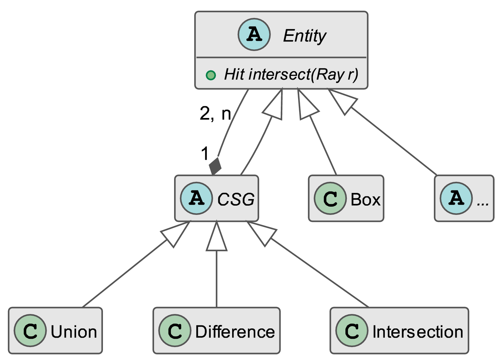
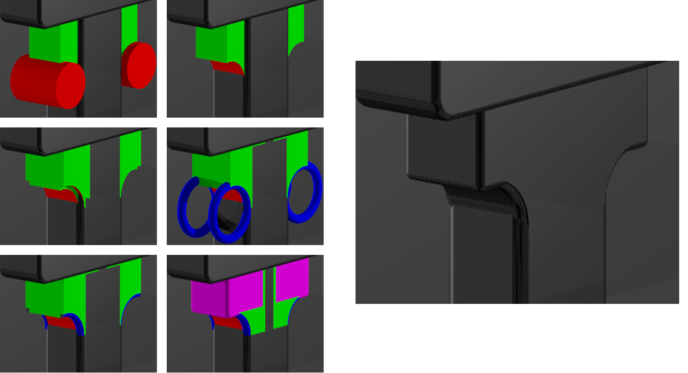
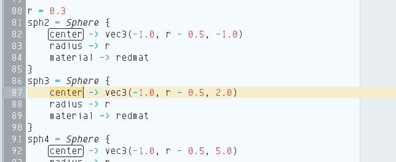

% CRT -- Thesis Defense
% Hamza Haiken
% 8 September 2015

# Introduction

## CRT

\


- Stands for \textsc{Cathode Ray Tracer}
- Available on GitHub: https://github.com/Tenchi2xh/CRT

---

\tableofcontents

## Goal

- Artistic conception tool
- Realistic 3D images via ray tracing
- Physical light simulation
- Custom language & compiler
- Flexible user interface
- OpenGL live view

---


---


---

## Technologies

- Java 8
- Maths & Physics
- ANTLR4
- OpenGL (jPCT, LWJGL)
- Docking Frames

# Ray Tracing

## Classical method

\begin{columns}
\begin{column}{0.48\textwidth}
\begin{itemize}
\item Live 3D uses rasterisation
\item World is approximated using triangles
\item Project triangles on screen
\item Fill the gaps with color
\item \emph{Hacks} to produce real-life effects
\item Fast, accelerated with hardware
\end{itemize}
\end{column}
\begin{column}{0.48\textwidth}
\begin{figure}
\includegraphics[width=0.8\linewidth]{img/rasterisation.png}
\caption{Rasterization}
\end{figure}
\end{column}
\end{columns}

## Principle

- Simulate light's path and interactions with environment
- Objects absorb color from rays hitting them, makes colors
- $\rightarrow$ Slow, but accurate and realistic simulation of light

---

- Tracing forward like in nature is too costly
- Backward-tracing requires only one ray per pixel
- Rays are traced from the camera and look for light sources
- Rays can bounce off surfaces
- Effects are naturally derived from physics

\begin{figure}
\includegraphics[width=0.54\linewidth]{img/ray-tracing.png}
\caption{Backward-tracing}
\end{figure}

## Modelization

- Top-level `Scene` object
- Contains `Entities` and `Lights`
- CSG is recursive

---


---



## Generating rays

\begin{figure}[!htbp]
\centering
\begin{tikzpicture}[scale=0.9]
\coordinate (o) at (-3, 0, 0);

\draw[fill] (o) circle (1pt) node[left]{$\vec{o}$};
\draw[thick] (o) -- (0.8, 0, 0);
\draw[thick, dashed] (0.8, 0, 0) -- (2, 0, 0);
\draw[->, thick, >=latex] (2, 0, 0) -- (4, 0, 0) node[right]{$\vec{d}$};

\draw[very thin] (2, -1.0, -3.0) -- ++(0, 0, 6);
\draw[very thin] (2, 1.0, -3.0) -- ++(0, 0, 6);
\draw[very thin] (2, 3.0, -3.0) -- ++(0, 0, 6);

\draw[very thin] (2, -1.0, -3.0) -- ++(0, 4, 0);
\draw[very thin] (2, -1.0, -1.0) -- ++(0, 4, 0);
\draw[very thin] (2, -1.0, 1.0) -- ++(0, 4, 0);
\draw[very thin] (2, -1.0, 3.0) -- ++(0, 4, 0);

%\draw[loosely dotted] (o) -- (2, -3, -3);
%\draw[loosely dotted] (o) -- (2, 3, -3);
%\draw[loosely dotted] (o) -- (2, -3, 3);
%\draw[loosely dotted] (o) -- (2, 3, 3);

\coordinate (p4) at (2, 0, -2);
\coordinate (p5) at (2, 0, 0);
\coordinate (p6) at (2, 0, 2);
\coordinate (p7) at (2, 2, -2);
\coordinate (p8) at (2, 2, 0);
\coordinate (p9) at (2, 2, 2);

\draw[fill] (p4) circle (0.5pt);
\draw[fill] (p5) circle (1pt);
\draw[fill] (p6) circle (0.5pt);
\draw[fill] (p7) circle (1pt) node[above]{$\vec{p}_{i,j}$};
\draw[fill] (p8) circle (0.5pt);
\draw[fill] (p9) circle (0.5pt);

\draw[] (o) -- (2, 3, 3);
\draw[->, >=latex, dashed] (2, 3, 3) -- (p7);
\draw[dotted] (2, 0, 0) -- (2, 0, -2);
\draw[dotted] (p7) -- (2, 0, -2);
\draw[dotted] (o) -- (2, 0, -2);

\draw[decorate, decoration={brace, amplitude=5pt}, xshift=2pt] ([xshift=2pt]p7) -- node[right, xshift=4pt, yshift=-2pt]{$n_y$} (2, 0, -2);

\draw[decorate, decoration={brace, amplitude=5pt, mirror}, xshift=2pt] (2, 0, 0) -- node[below right, xshift=2pt]{$n_x$} (2, 0, -2);

\end{tikzpicture}
\caption{Primary ray generation}
\end{figure}

## Shading

- Color of point depends on how ray touches surface:
    + Angle of incidence
    + Angle of the light source
    + Distance / number of bounces
    + Material of the object

---

\begin{figure}
\centering

\subfloat[Ambient]{\centering\makebox[.24\linewidth]{
\includegraphics[width=0.20\linewidth,keepaspectratio]{img/phong_ambient.png}}}
\subfloat[Diffuse]{\centering\makebox[.24\linewidth]{
\includegraphics[width=0.20\linewidth,keepaspectratio]{img/phong_diffuse.png}}}
\subfloat[Specular]{\centering\makebox[.24\linewidth]{
\includegraphics[width=0.20\linewidth,keepaspectratio]{img/phong_specular.png}}}
\subfloat[Combined]{\centering\makebox[.24\linewidth]{
\includegraphics[width=0.20\linewidth,keepaspectratio]{img/phong_combined.png}}}

\caption[Phong shading model]{Phong shading model --- light components are computed in steps.}
\end{figure}

---

- Ambient lighting hack: $\vec{c}_{\textrm{a}} = l_{\textrm{a}} \vec{l}_{\textrm{c}}$

\centering\includegraphics[width=0.40\linewidth,keepaspectratio]{img/phong_ambient.png}

---

- Diffuse light, approximation using angle with normal: $\vec{c}_{\textrm{d}} = \Big[\vec{l}_{\textrm{c}} \textrm{isl} (\vec{l}_{\textrm{d}} \cdot \vec{n})\Big] \cdot (\vec{m}_{\textrm{c}} m_{\textrm{d}})$

\centering\includegraphics[width=0.40\linewidth,keepaspectratio]{img/phong_diffuse.png}

---

\begin{figure}
\centering

\subfloat[Rays parallel with normal]{%
\centering
\makebox[.45\linewidth]{
\begin{tikzpicture}[rotate=-45, scale=0.7]

  \draw[dashed] (0.0, 0.0) -- (1.5, 0.0);
  \draw[dashed] (0.0, 1.0) -- (1.5, 1.0);
  \draw[dashed] (0.0, 2.0) -- (1.5, 2.0);

  \draw[->, >=latex] (1.5, 0.0) -- (3.0, 0.0);
  \draw[->, >=latex] (1.5, 1.0) -- (3.0, 1.0);
  \draw[->, >=latex] (1.5, 2.0) -- (3.0, 2.0);

  \draw[<->] (0.5, 1.0) -- node[midway, below right]{$x$} (0.5, 0.0);

  \draw[very thick] (3.0, -0.5) -- (3.0, 2.5);
  \fill[pattern=vertical lines] (3.0, -0.5) rectangle (3.2, 2.5);
\end{tikzpicture}}}%
\subfloat[Rays at \SI{45}{\degree} with normal]{%
\centering
\makebox[.45\linewidth]{
\begin{tikzpicture}[rotate=-45, scale=0.7]

  \draw[->, >=latex, thick] (3.0, 1.0) -- ++(-2, 2) node[above]{$\vec{n}$};

  \draw[dashed] (0.0, 0.0) -- (1.5, 0.0);
  \draw[dashed] (0.0, 1.0) -- (1.5, 1.0);
  \draw[dashed] (0.0, 2.0) -- (1.5, 2.0);

  \draw[->, >=latex] (1.5, 0.0) -- (2.0, 0.0);
  \draw[->, >=latex] (1.5, 1.0) -- (3.0, 1.0);
  \draw[->, >=latex] (1.5, 2.0) -- (4.0, 2.0);

  \draw[<->] (0.5, 0.0) -- node[midway, above, fill=white, inner sep=1.1pt]{$\sqrt{x}$} ++(1.0, 1.0);

  \draw[very thick] (1.5, -0.5) -- (4.3, 2.3);
  \fill[pattern=north east lines, rotate=-45] (1.4, 0.7) rectangle ++(0.3, 4.0);
  \fill[fill=white] (2.5, -1) rectangle ++(0.1, 0);
\end{tikzpicture}}}%
\caption{Impact of normal angle for diffuse light}
\end{figure}

---

- Specular light, using reflected rays: $\vec{c}_{\textrm{s}} = (\vec{l'} \cdot \vec{r})^{m_{\textrm{sh}}} m_{\textrm{s}} \textrm{isl} (\vec{l}_{\textrm{c}} \cdot \vec{m}_{\textrm{c}})$

\centering\includegraphics[width=0.40\linewidth,keepaspectratio]{img/phong_specular.png}

---

\begin{figure}[!htbp]
\centering\begin{tikzpicture}[scale=0.7]

  \draw[->, >=latex, thick] (0, 0) -- ++(0, 3) node[above]{$\vec{n}$};
  \draw[->, >=latex] (60:3) node[above right]{$\vec{l}$} -- (0, 0);
  \draw[->, >=latex, dashed] (0, 0) -- (120:3) node[above left]{$\vec{l'}$};
  \draw[->, >=latex, thick] (150:3) node[above left]{$\vec{r}$} -- (0, 0);

  \draw (120:1) arc (120:150:1) node at (135:1.3) {$\alpha$};

  \draw[very thick] (-2, 0) -- (2, 0);
  \fill[pattern=north east lines] (-2, 0) rectangle (2, -0.2);

\end{tikzpicture}

\caption{Angle between reflected light ray and primary ray}
\label{fig:angles}
\end{figure}

---

- Final composite color for a pixel: $\vec{c}_{\textrm{a}} + \vec{c}_{\textrm{d}} + \vec{c}_{\textrm{s}}$

\centering\includegraphics[width=0.40\linewidth,keepaspectratio]{img/phong_combined.png}

---

- Inverse square law: $\textrm{isl} \propto \frac{1}{t^2}$

---


## Primitives

- For each type of volume, compute its intersection with a ray
- Requires solving vector equations

## CSG

- Primitives are too simple for artistic creativity
- Constructive Solid Geometry combines objects in 3 ways:
    + Union
    + Intersection
    + Difference

\begin{figure}
\centering
\subfloat[Union]{\centering\makebox[.33\linewidth]{
\includegraphics[width=0.23\linewidth,keepaspectratio]{img/union.png}}}
\subfloat[Intersection]{\centering\makebox[.33\linewidth]{
\includegraphics[width=0.23\linewidth,keepaspectratio]{img/intersection.png}}}
\subfloat[Difference]{\centering\makebox[.33\linewidth]{
\includegraphics[width=0.23\linewidth,keepaspectratio]{img/difference.png}}}
\caption[Different supersampling values]{All three CSG types}
\end{figure}

---

- Recursive implementation
- Compare distances, see what object gets hit first
- Continue to the end of the objects
- Return appropriate normals and distances

---



## Animations

- Simple system
- User can use variable `t` in code
- User chooses a number of frames and the animation is rendered

## Also implemented

Other notable features:

### Depth of field
Shifting the ray's origin with a random offest

### Supersampling
Split each pixel into subpixel coordinates, trace multiple rays

### Backgrounds
Spherical mapping of 360° panoramas

---

\begin{figure}[!htpb]
\centering
\tikzset{middlearrow/.style={
        decoration={markings,
            mark= at position 0.5 with {\arrow{####1}} ,
        },
        postaction={decorate}
    }
}
\begin{tikzpicture}[]
  \draw[middlearrow={latex}] (-1.0, 0.0) -- (0.0, 3.0);
  \draw[middlearrow={latex}] (0.0, 0.0)  -- (0.0, 3.0);
  \draw[middlearrow={latex}] (1.0, 0.0)  -- (0.0, 3.0);

  \draw[->, >=latex] (0.0, 3.0) -- (-1.0, 6.0);
  \draw[->, >=latex] (0.0, 3.0) -- (0.0, 5.0);
  \draw[->, >=latex] (0.0, 3.0) -- (1.0, 6.0);

  \draw[dashed] (-2.0, 3.0) -- (2.0, 3.0) node[right]{Focal plane};
  \draw[thick] (0,0) ellipse (1.0 and 0.2) node[right, xshift=1.0cm]{Aperture disc};

  \draw[fill] (0.0, 3.0) circle (1.2pt) node[right]{$\vec{p'}$};
  \draw[fill] (0.0, 5.0) circle (1.2pt) node[above]{$\vec{p}$};
\end{tikzpicture}
\caption{Disc-shaped aperture}
\label{fig:dofdiagram}
\end{figure}

---


---

\begin{figure}
\centering
\subfloat[No supersampling]{\centering\makebox[.33\linewidth]{
\includegraphics[width=0.28\linewidth,keepaspectratio]{img/ss1.png}}}
\subfloat[$2\times 2$ SSAA]{\centering\makebox[.33\linewidth]{
\includegraphics[width=0.28\linewidth,keepaspectratio]{img/ss2.png}}}
\subfloat[$4\times 4$ SSAA]{\centering\makebox[.33\linewidth]{
\includegraphics[width=0.28\linewidth,keepaspectratio]{img/ss3.png}}}
\caption[Different supersampling values]{Different supersampling values}
\end{figure}

---

\begin{figure}[!htbp]
\centering
\subfloat[Solid colour]{\centering\makebox[.33\linewidth]{
\includegraphics[width=0.28\linewidth,keepaspectratio]{img/bgsolid.png}}}
\subfloat[Gradient model]{\centering\makebox[.33\linewidth]{
\includegraphics[width=0.28\linewidth,keepaspectratio]{img/bgzenith.png}}}
\subfloat[Panorama projection]{\centering\makebox[.33\linewidth]{
\includegraphics[width=0.28\linewidth,keepaspectratio]{img/bgpanorama.png}}}
\caption[All 3 different background types]{All 3 different background types}
\label{fig:ssaa}
\end{figure}

# CRT Language

## Goal

- Simple language
- Control every aspect of the rendering
- Define user variables, references
- Simple loops and conditions
- Macros

## Aspect

```{.haskell caption="Sample CRT script"}
--Entities-------------------------------------------------
sphere1 = Sphere {
    center -> vec3(0, 0.5, 0)
    radius -> 0.5
}

--Constants------------------------------------------------
n = 18
max = (3 * n) / 4 + 5

--Macros---------------------------------------------------
myMacro = Macro (arg1) {
    i = 0
    -- Draw sphere1 "max" times on the x axis
    while (i < max) {
        sphere1 <translate vec3(i*1.0, 0.0, 0.0)>
        i = i - 1
    }
}
```

## ANTLR

- Provides easy syntax for grammar
- Generates all the lexer and parser code
- Also generates base classes for *visitors* and *listeners*


## Grammar

- Non-ambiguous design (context-free)
- Left-recursion for simplicity
- Labelling of alternatives generates a visitor method for each

## Compiling

- Top-down process
- Many tests on types, can't use polymorphism
- Accent on exceptions and error handling
- Recursive variable solving
- Nested scopes resolution

# Interface

## Text editor

- Syntax highlighting using lexer
- Occurrences highlighting

---



## Graphs

- AWT
- Multiplatform
- No third party dependency
- Uses obscure Java APIs

---


## Console

- Intercepts `stdout` and `stderr`
- Custom `PrintStream`

## Property sheet

- NetBeans Open Platform API
- Java Beans
- Custom editors

---


## Docking frames

- Easy to use
- Robust
- Hard to customize

---


## Live view

- Doesn't exist in current pure Ray Tracing applications
- Gives the user a good feel of where the objects are placed
- A converter takes a `Scene` object and generates corresponding OpenGL constructs

---


---


# Demonstration

# Conclusion

---

- Very complete project, involved a lot of fields
- Big scope, hard to implement all the ideas
- Good end result, usable as is

## Continuation

- Drag-and-drop
- Code generation
    + Property sheets change code
    + Settings tab changes code

# Q&A
