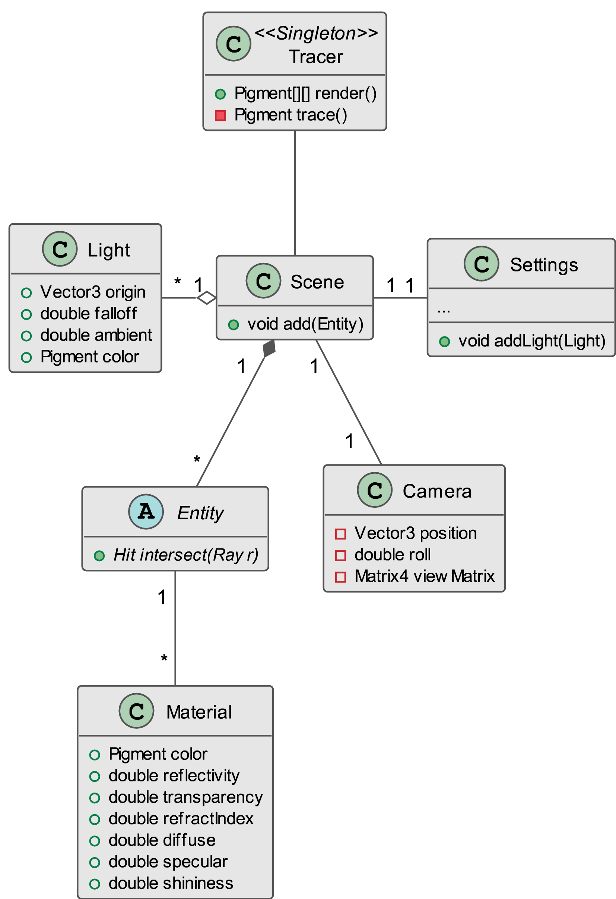

% CRT -- Intermediary Presentation
% Hamza Haiken
% 24 June 2015

# Introduction

## CRT

\


- Stands for \textsc{Cathode Ray Tracer}
- Available on GitHub: https://github.com/Tenchi2xh/CRT

---

\tableofcontents

## Goal

- Artistic conception tool
- Realistic 3D images via ray tracing
- Physical light simulation
- Custom language

---


# Ray Tracing

## Classical method

- Live 3D uses rasterisation
- World is approximated using triangles
- Project triangles on screen
- Fill the gaps with color
- Many *hacks* to produce real-life effects
- Fast

---


## Principle

- Simulate light's path and interactions with environment
- Objects absorb color from rays hitting them, makes colors
- Tracing forward like in nature is too costly
- Backward-tracing requires only one ray per pixel
- Rays are traced from the camera and look for light sources
- Rays can bounce off surfaces
- Effects are naturally derived from physics

---


## Modelization

- Top-level `Scene` object
- Contains `Entities` and `Lights`
- CSG is recursive

---



---


## Generating rays

\begin{figure}[!htbp]
\centering
\begin{tikzpicture}[scale=0.9]
\coordinate (o) at (-3, 0, 0);

\draw[fill] (o) circle (1pt) node[left]{$\vec{o}$};
\draw[thick] (o) -- (0.8, 0, 0);
\draw[thick, dashed] (0.8, 0, 0) -- (2, 0, 0);
\draw[->, thick, >=latex] (2, 0, 0) -- (4, 0, 0) node[right]{$\vec{d}$};

\draw[very thin] (2, -1.0, -3.0) -- ++(0, 0, 6);
\draw[very thin] (2, 1.0, -3.0) -- ++(0, 0, 6);
\draw[very thin] (2, 3.0, -3.0) -- ++(0, 0, 6);

\draw[very thin] (2, -1.0, -3.0) -- ++(0, 4, 0);
\draw[very thin] (2, -1.0, -1.0) -- ++(0, 4, 0);
\draw[very thin] (2, -1.0, 1.0) -- ++(0, 4, 0);
\draw[very thin] (2, -1.0, 3.0) -- ++(0, 4, 0);

%\draw[loosely dotted] (o) -- (2, -3, -3);
%\draw[loosely dotted] (o) -- (2, 3, -3);
%\draw[loosely dotted] (o) -- (2, -3, 3);
%\draw[loosely dotted] (o) -- (2, 3, 3);

\coordinate (p4) at (2, 0, -2);
\coordinate (p5) at (2, 0, 0);
\coordinate (p6) at (2, 0, 2);
\coordinate (p7) at (2, 2, -2);
\coordinate (p8) at (2, 2, 0);
\coordinate (p9) at (2, 2, 2);

\draw[fill] (p4) circle (0.5pt);
\draw[fill] (p5) circle (1pt);
\draw[fill] (p6) circle (0.5pt);
\draw[fill] (p7) circle (1pt) node[above]{$\vec{p}_{i,j}$};
\draw[fill] (p8) circle (0.5pt);
\draw[fill] (p9) circle (0.5pt);

\draw[] (o) -- (2, 3, 3);
\draw[->, >=latex, dashed] (2, 3, 3) -- (p7);
\draw[dotted] (2, 0, 0) -- (2, 0, -2);
\draw[dotted] (p7) -- (2, 0, -2);
\draw[dotted] (o) -- (2, 0, -2);

\draw[decorate, decoration={brace, amplitude=5pt}, xshift=2pt] ([xshift=2pt]p7) -- node[right, xshift=4pt, yshift=-2pt]{$n_y$} (2, 0, -2);

\draw[decorate, decoration={brace, amplitude=5pt, mirror}, xshift=2pt] (2, 0, 0) -- node[below right, xshift=2pt]{$n_x$} (2, 0, -2);

\end{tikzpicture}
\caption{Primary ray generation}
\end{figure}

## Shading

- Color of point depends on how ray touches surface:
    + Angle of incidence
    + Angle of the light source
    + Distance / number of bounces

---

- Inverse square law: $I \propto \frac{1}{t^2}$
- Ambient lighting hack: $\vec{c}_{\textrm{a}} = l_{\textrm{a}} \vec{l}_{\textrm{c}}$
- Diffuse light, approximation using angle with normal: $\vec{c}_{\textrm{d}} = \Big[\vec{l}_{\textrm{c}} I (\vec{l}_{\textrm{d}} \cdot \vec{n})\Big] \cdot (\vec{m}_{\textrm{c}} m_{\textrm{d}})$
- Specular light, using reflected rays: $\vec{c}_{\textrm{s}} = (\vec{l'} \cdot \vec{r})^{m_{\textrm{sh}}} m_{\textrm{s}} I (\vec{l}_{\textrm{c}} \cdot \vec{m}_{\textrm{c}})$
- Final composite color for a pixel: $\vec{c}_{\textrm{a}} + \vec{c}_{\textrm{d}} + \vec{c}_{\textrm{s}}$

---


---

\begin{figure}
\centering

\subfloat[Rays parallel with normal]{%
\centering
\makebox[.45\linewidth]{
\begin{tikzpicture}[rotate=-45, scale=0.7]

  \draw[dashed] (0.0, 0.0) -- (1.5, 0.0);
  \draw[dashed] (0.0, 1.0) -- (1.5, 1.0);
  \draw[dashed] (0.0, 2.0) -- (1.5, 2.0);

  \draw[->, >=latex] (1.5, 0.0) -- (3.0, 0.0);
  \draw[->, >=latex] (1.5, 1.0) -- (3.0, 1.0);
  \draw[->, >=latex] (1.5, 2.0) -- (3.0, 2.0);

  \draw[<->] (0.5, 1.0) -- node[midway, below right]{$x$} (0.5, 0.0);

  \draw[very thick] (3.0, -0.5) -- (3.0, 2.5);
  \fill[pattern=vertical lines] (3.0, -0.5) rectangle (3.2, 2.5);
\end{tikzpicture}}}%
\subfloat[Rays at \SI{45}{\degree} with normal]{%
\centering
\makebox[.45\linewidth]{
\begin{tikzpicture}[rotate=-45, scale=0.7]

  \draw[->, >=latex, thick] (3.0, 1.0) -- ++(-2, 2) node[above]{$\vec{n}$};

  \draw[dashed] (0.0, 0.0) -- (1.5, 0.0);
  \draw[dashed] (0.0, 1.0) -- (1.5, 1.0);
  \draw[dashed] (0.0, 2.0) -- (1.5, 2.0);

  \draw[->, >=latex] (1.5, 0.0) -- (2.0, 0.0);
  \draw[->, >=latex] (1.5, 1.0) -- (3.0, 1.0);
  \draw[->, >=latex] (1.5, 2.0) -- (4.0, 2.0);

  \draw[<->] (0.5, 0.0) -- node[midway, above, fill=white, inner sep=1.1pt]{$\sqrt{x}$} ++(1.0, 1.0);

  \draw[very thick] (1.5, -0.5) -- (4.3, 2.3);
  \fill[pattern=north east lines, rotate=-45] (1.4, 0.7) rectangle ++(0.3, 4.0);
  \fill[fill=white] (2.5, -1) rectangle ++(0.1, 0);
\end{tikzpicture}}}%
\caption{Impact of normal angle for diffuse light}
\end{figure}

---

\begin{figure}
\centering

\subfloat[Ambient]{\centering\makebox[.24\linewidth]{
\includegraphics[width=0.20\linewidth,keepaspectratio]{img/phong_ambient.png}}}
\subfloat[Diffuse]{\centering\makebox[.24\linewidth]{
\includegraphics[width=0.20\linewidth,keepaspectratio]{img/phong_diffuse.png}}}
\subfloat[Specular]{\centering\makebox[.24\linewidth]{
\includegraphics[width=0.20\linewidth,keepaspectratio]{img/phong_specular.png}}}
\subfloat[Combined]{\centering\makebox[.24\linewidth]{
\includegraphics[width=0.20\linewidth,keepaspectratio]{img/phong_combined.png}}}

\caption[Phong shading model]{Phong shading model --- light components are computed in steps.}
\end{figure}

## Primitives

- For each type of volume, compute its intersection with a ray
- Requires solving vector equations

## CSG

- Primitives are too simple for artistic creativity
- Constructive Solid Geometry combines objects in 3 ways:
    + Union
    + Intersection
    + Difference

\begin{figure}
\centering
\subfloat[Union]{\centering\makebox[.33\linewidth]{
\includegraphics[width=0.18\linewidth,keepaspectratio]{img/union.png}}}
\subfloat[Intersection]{\centering\makebox[.33\linewidth]{
\includegraphics[width=0.18\linewidth,keepaspectratio]{img/intersection.png}}}
\subfloat[Difference]{\centering\makebox[.33\linewidth]{
\includegraphics[width=0.18\linewidth,keepaspectratio]{img/difference.png}}}
\caption[Different supersampling values]{All three CSG types}
\end{figure}

---

- Recursive implementation
- Compare distances, see what object gets hit first
- Continue to the end of the objects
- Return appropriate normals and distances

---


## Also implemented

Other notable features:

### Depth of field
Shifting the ray's origin with a random offest

### Supersampling
Split each pixel into subpixel coordinates, trace multiple rays

### Backgrounds
Spherical mapping of 360° panoramas

---

\begin{figure}
\centering
\subfloat[No supersampling]{\centering\makebox[.33\linewidth]{
\includegraphics[width=0.28\linewidth,keepaspectratio]{img/ss1.png}}}
\subfloat[$2\times 2$ SSAA]{\centering\makebox[.33\linewidth]{
\includegraphics[width=0.28\linewidth,keepaspectratio]{img/ss2.png}}}
\subfloat[$4\times 4$ SSAA]{\centering\makebox[.33\linewidth]{
\includegraphics[width=0.28\linewidth,keepaspectratio]{img/ss3.png}}}
\caption[Different supersampling values]{Different supersampling values}
\end{figure}

# CRT Language

## Goal

- Simple language
- Control every aspect of the rendering
- Define user variables, references
- Simple loops and conditions
- Macros

## Aspect

```{.haskell caption="Sample CRT script"}
--Entities-------------------------------------------------
sphere1 = Sphere {
    center -> vec3(0, 0.5, 0)
    radius -> 0.5
}

--Constants------------------------------------------------
n = 18
max = (3 * n) / 4 + 5

--Macros---------------------------------------------------
myMacro = Macro (arg1) {
    i = 0
    -- Draw sphere1 "max" times on the x axis
    while (i < max) {
        sphere1 <translate vec3(i*1.0, 0.0, 0.0)>
        i = i - 1
    }
}
```

## ANTLR

- Provides easy syntax for grammar
- Generates all the lexer and parser code
- Also generates base classes for *visitors* and *listeners*


## Grammar

- Non-ambiguous design (context-free)
- Left-recursion for simplicity
- Labelling of alternatives generates a visitor method for each

## Compiling

- Top-down process
- Many tests on types, can't use polymorphism
- Accent on exceptions and error handling
- Recursive variable solving
- Nested scopes resolution

# Interface

## Implemented features
## Text editor
## Docking frames
## Netbeans API
## Live view

# Demonstration

# Conclusion

## What remains ?

- Animations
- Drag-and-drop
- Code generation
- User interface